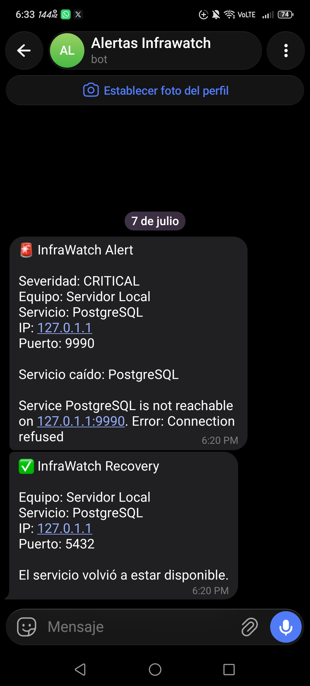

# InfraWatch Monitoring System

<p align="center">
  <strong>Sistema web de monitoreo de infraestructura TI</strong>
</p>

<p align="center">
  
  
  
  
  
</p>

---

## Descripción

**InfraWatch** es un sistema web de monitoreo de infraestructura TI desarrollado con **Laravel**, **Filament**, **PostgreSQL** y un **agente Python**.

El sistema permite registrar equipos, monitorear servicios de red mediante puertos TCP, recolectar métricas del sistema, visualizar gráficas, consultar alertas y recibir notificaciones automáticas vía Telegram.

Está pensado como una solución base para supervisar servidores, estaciones de trabajo, servicios internos y métricas básicas como CPU, RAM, disco y uptime.

---

## Características principales

- Panel administrativo con Filament.
- Registro de equipos monitoreados.
- Registro de servicios TCP asociados a cada equipo.
- Monitoreo de puertos TCP mediante comando Artisan.
- Ejecución automática mediante Laravel Scheduler.
- Historial de chequeos de servicios.
- Generación de alertas cuando un servicio deja de responder.
- Resolución automática de alertas cuando el servicio vuelve a estar disponible.
- Notificaciones automáticas vía Telegram para alertas y recuperaciones.
- Agente Python para recolectar métricas del sistema.
- Configuración segura del agente mediante archivo `.env`.
- API REST para recepción de métricas.
- Dashboard con estadísticas generales.
- Dashboard con gráficas de CPU, RAM y disco.
- Tabla de últimas métricas recibidas.
- Tabla de servicios caídos.
- Tabla de hosts con mayor uso de recursos.
- Panel de control para ejecutar monitoreo TCP y agente Python desde Filament.
- Base de datos PostgreSQL.
- Entorno local con Docker.

---

## Tecnologías utilizadas

| Área | Tecnología |
|---|---|
| Backend | Laravel |
| Panel administrativo | Filament |
| Base de datos | PostgreSQL |
| Contenedores | Docker |
| Agente | Python |
| Métricas del sistema | psutil |
| Variables de entorno del agente | python-dotenv |
| Comunicación HTTP | requests |
| Notificaciones | Telegram Bot API |
| Control de versiones | Git / GitHub |

---

## Arquitectura general

```text
+-------------------------+
| Equipo monitoreado      |
| Agente Python           |
| CPU / RAM / Disco       |
+-----------+-------------+
            |
            | HTTP POST /api/agent/metrics
            v
+-------------------------+
| Backend Laravel         |
| API + Comandos Artisan  |
| Filament Admin Panel    |
+-----------+-------------+
            |
            v
+-------------------------+
| PostgreSQL              |
| Hosts / Services        |
| Metrics / Alerts        |
+-----------+-------------+
            |
            v
+-------------------------+
| Dashboard Filament      |
| Estado general          |
| Gráficas / Alertas      |
+-------------------------+
            |
            v
+-------------------------+
| Telegram                |
| Alertas y recuperación  |
+-------------------------+
```

Documentación completa:

- [Arquitectura](docs/architecture.md)
- [API](docs/api.md)
- [Notificaciones por Telegram](docs/telegram.md)

---

## Capturas del sistema

### Dashboard principal


### Equipos monitoreados


### Servicios monitoreados


### Historial de chequeos


### Métricas del host


### Alertas


### Alertas via Telegram



> Si alguna imagen no aparece en GitHub, verificar que exista dentro de `docs/screenshots/` y que el nombre del archivo coincida exactamente.

---

## Estructura del proyecto

```text
infrawatch-monitoring-system/
├── backend/
│   ├── app/
│   ├── config/
│   ├── database/
│   ├── routes/
│   ├── resources/
│   ├── docker-compose.yml
│   ├── .env.example
│   └── README.md
│
├── agent/
│   ├── agent.py
│   ├── requirements.txt
│   ├── .env.example
│   └── README.md
│
├── docs/
│   ├── architecture.md
│   ├── api.md
│   ├── telegram.md
│   └── screenshots/
│
├── .gitignore
└── README.md
```

---

## Módulos principales

| Módulo | Descripción |
|---|---|
| Monitored Hosts | Registro de equipos monitoreados. |
| Monitored Services | Servicios TCP asociados a cada equipo. |
| Service Checks | Historial de revisiones de disponibilidad. |
| Host Metrics | Métricas enviadas por el agente Python. |
| Alerts | Alertas generadas por fallos detectados. |
| Dashboard | Vista general del estado de la infraestructura. |
| Monitoring Control | Panel para ejecutar monitoreo TCP y agente desde Filament. |
| Telegram Notifications | Envío de alertas y recuperaciones vía Telegram. |

---

## Instalación rápida

### 1. Clonar el repositorio

```bash
git clone https://github.com/Josue-Isai-Sanchez-Santos/infrawatch-monitoring-system.git
cd infrawatch-monitoring-system
```

### 2. Instalar backend

```bash
cd backend
composer install
cp .env.example .env
php artisan key:generate
docker compose up -d
php artisan migrate
php artisan make:filament-user
php artisan serve
```

Panel administrativo:

```text
http://127.0.0.1:8000/admin
```

### 3. Instalar agente Python

En otra terminal:

```bash
cd agent
python3 -m venv venv
source venv/bin/activate
pip install -r requirements.txt
cp .env.example .env
```

Editar `agent/.env`:

```env
API_URL=http://127.0.0.1:8000/api/agent/metrics
AGENT_TOKEN=your-agent-token-here
INTERVAL_SECONDS=60
```

Ejecutar el agente una sola vez:

```bash
python agent.py --once
```

Ejecutar el agente de forma continua:

```bash
python agent.py --interval 60
```

---

## Comandos principales

### Ejecutar monitoreo TCP manual

```bash
php artisan monitor:services
```

### Ejecutar scheduler en desarrollo

```bash
php artisan schedule:work
```

### Ejecutar tareas programadas una sola vez

```bash
php artisan schedule:run
```

### Limpiar caché de Laravel

```bash
php artisan optimize:clear
```

### Ver rutas registradas

```bash
php artisan route:list
```

---

## API

InfraWatch cuenta con una API para recibir métricas desde agentes externos.

Endpoint principal:

```http
POST /api/agent/metrics
```

Documentación completa:

[Ver documentación de API](docs/api.md)

---

## Notificaciones por Telegram

InfraWatch puede enviar notificaciones automáticas a Telegram cuando un servicio cae o vuelve a estar disponible.

Variables requeridas en `backend/.env`:

```env
TELEGRAM_ENABLED=true
TELEGRAM_BOT_TOKEN=your-telegram-bot-token
TELEGRAM_CHAT_ID=your-chat-id
```

Documentación completa:

[Ver documentación de Telegram](docs/telegram.md)

---

## Estado actual

Versión actual: **V1 funcional en desarrollo**

Funcionalidades implementadas:

- Backend Laravel funcional.
- Panel administrativo con Filament.
- Base de datos PostgreSQL en Docker.
- CRUD de equipos monitoreados.
- CRUD de servicios monitoreados.
- Comando de monitoreo TCP.
- Scheduler de Laravel.
- Historial de chequeos.
- Dashboard con estadísticas generales.
- Dashboard con gráficas de CPU, RAM y disco.
- Tabla de últimas métricas recibidas.
- Tabla de hosts con mayor uso de recursos.
- Tabla de servicios caídos.
- Alertas básicas.
- Resolución automática de alertas.
- Notificaciones vía Telegram.
- Agente Python para métricas del sistema.
- Agente configurable mediante `.env`.
- API para recepción de métricas.
- Panel de control para ejecutar procesos manuales y automáticos.

---

## Próximas mejoras

- Botones para detener procesos automáticos desde el panel.
- Notificaciones por correo electrónico.
- Roles y permisos.
- Reportes PDF.
- Limpieza automática de métricas antiguas.
- Docker Compose completo para backend, base de datos y servicios auxiliares.
- Tests automatizados.
- GitHub Actions.
- Deploy en VPS o servidor local.
- Instalación del agente como servicio del sistema.

---

## Seguridad

El archivo `.env` no debe subirse al repositorio.

Archivos que sí pueden subirse:

```text
.env.example
```

Credenciales que deben mantenerse privadas:

- `APP_KEY`
- `DB_PASSWORD` si se usa una contraseña real
- `AGENT_TOKEN`
- `TELEGRAM_BOT_TOKEN`
- `TELEGRAM_CHAT_ID`

---

## Autor

Desarrollado por **Josue Isai Sanchez Santos** como proyecto de portafolio técnico enfocado en sistemas, redes, monitoreo e infraestructura TI.
